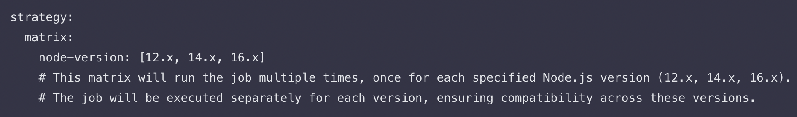
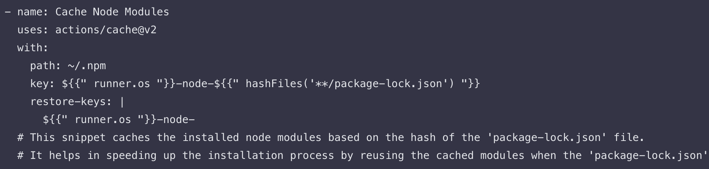
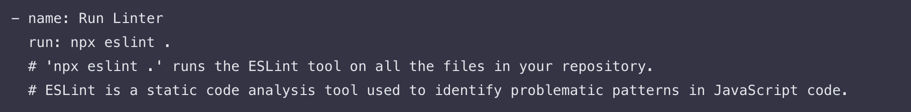
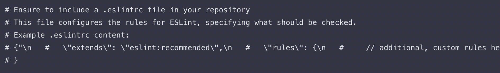

#### Module 3: Implementing Continuous Integration 

### Introduction to Module 3: Implementing Continuous Integration with GitHub Actions

Module 3 of GitHub Actions course, focused on Implementing Continuous Integration. In this module, we will delve into more advanced aspect of GitHub Actions, learning how to configure build matrices for testing across multiple environments and integrating essential code quality checks. Wether you are an aspiring developer or an experienced coder looking to streamline your workflow, this module is designed to enhance your skills in improving the quality of your software development process.

### Why Continuous  Integration is Essential for Learners

Imagine you're building a complex puzzle. Each piece represents a part of your code a feature, a bug fix, or a new functionality. In absence of continuous  integration, adding a new piece to the puzzle is like working in the dark. You hope it fits perfectly without affecting the existing pieces, but you cant be sure until the entire puzzle is complete. This approach is time-consuming and prone to errors. Now, imagine having a system that illuminates each new piece as you add it, instantly showing you how it fits with the existing ones. This is what continuous integration does for software development. It allows you to integrate changes frequently and detect issues early, ensuring that each 'piece' of your code seamlessly integrates with the existing 'puzzle' without disruptions. By mastering continuous integration with GitHub Actions, you are not just learning to code, you are learning to build your software puzzle efficiently, piece by piece, ensuring quality and cohesion at every step.

## Pre-requisites 

1. Proficiency in YAML (Refer to Project 2):

  - Basic understanding of YAML syntax and structure. 

  - Familiarity with writing and interpreting YAML files, as GitHub Actions workflows are defined in YAML.

  - Resource: [Learn YAML in Y Minutes][https://learnxinyminutes.com/yaml/]. 
  
2. Experience with GitHub and GitHub Actions:
  
  - Basic knowledge of how to use GitHub, including creating repositories and pushing code. 

  - A foundational understanding of GitHub Actions and how they work.

  -  Resource: [GitHub Actions Documentation.](https://docs.github.com/en/actions)
  
3. Understanding of Node.js and npm: 

  - Experience with Node.js, as the project examples are based on Node.js environments.

  - Familiarity with npm (Node Package Manager) for managing Node.js project dependencies.

  - Resource: [Node.js Documentation. ](https://nodejs.org/docs/latest/api/)
  
4. Familiarity with Software Testing Concepts:

  - Basic knowledge of software testing principles. 

  - Understanding of automated testing and its role in CI/CD.

5. Knowledge of Code Quality Tools:

  - Familiarity with static code analysis and linting tools, especially ESLint for JavaScript.
  
  - Resource: `https://eslint.org/`

6. Access to a Development Environment: 

  - A computer with Git, Node.js, and a text editor or IDE installed.

  - Internet access to clone the project repository and perform tasks online. 
  
7. Willingness to Experiment and Learn: 

  - An open-minded approach to learning new CI/CD practices.

  -  Eagerness to apply new concepts and troubleshoot potential issues.

 By fulfilling these prerequisites, learners will be well-prepared to dive into the lessons on configuring build matrices and integrating code quality checks, gaining hands-on experience in implementing continuous integration workflows with GitHub Actions. 
 
## Lesson 2: Configuring Build Matrices

# Objectives: 

  - Implement matrix builds to test across multiple versions or environments. 
  
  - Manage build dependencies efficiently. 
  

# Detailed Steps and Code Explanation:

1. Parallel and Matrix Builds:

  - A matrix build allows you to run jobs across multiple environments and versions simultaneously, increasing efficiency. 

  - This is useful for testing your application in different versions of runtime environments or dependencies.

2. Managing Build Dependencies: 

   - Handling dependencies and services required for your build process is crucial.

   - Utilize caching to reduce the time spent on downloading and installing dependencies repeatedly.

## Lesson 3: Integrating Code Quality Checks 

# Objectives: 

   - Integrate code analysis tools into the GitHub Actions workflow. 

   - Configure linters and static code analyzers for maintaining code quality. 
   
# Detailed Steps and Code Explanation: 
   
1. Adding Code Analysis Tools: 
   
   - Include steps in your workflow to run tools that analyze code quality and adherence to coding standards.

2. Configuring Linters and Static Code Analyzers:

   - Ensure your repository includes configuration files for these tools, such as `.eslintrc for ESLint.

